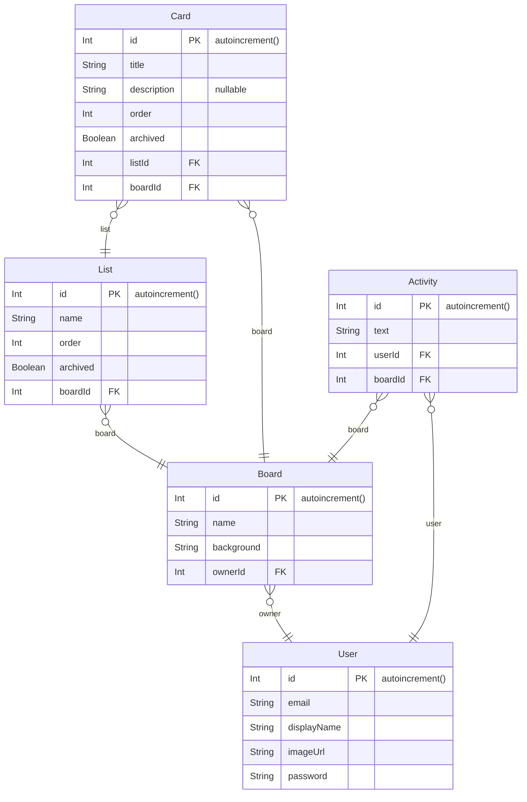

```mermaid
erDiagram
	User {
		Int id PK  "autoincrement()"
		String email
		String displayName
		String imageUrl
		String password
	}
	Board {
		Int id PK  "autoincrement()"
		String name
		String background
		Int ownerId FK
	}
	List {
		Int id PK  "autoincrement()"
		String name
		Int order
		Boolean archived
		Int boardId FK
	}
	Card {
		Int id PK  "autoincrement()"
		String title
		String description  "nullable"
		Int order
		Boolean archived
		Int listId FK
		Int boardId FK
	}
	Activity {
		Int id PK  "autoincrement()"
		String text
		Int userId FK
		Int boardId FK
	}
	Board }o--|| User : owner
	List }o--|| Board : board
	Card }o--|| List : list
	Card }o--|| Board : board
	Activity }o--|| User : user
	Activity }o--|| Board : board

```
